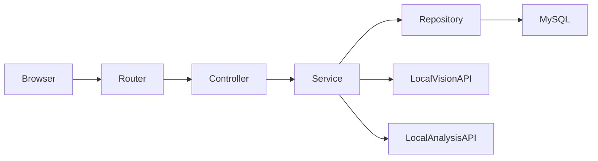
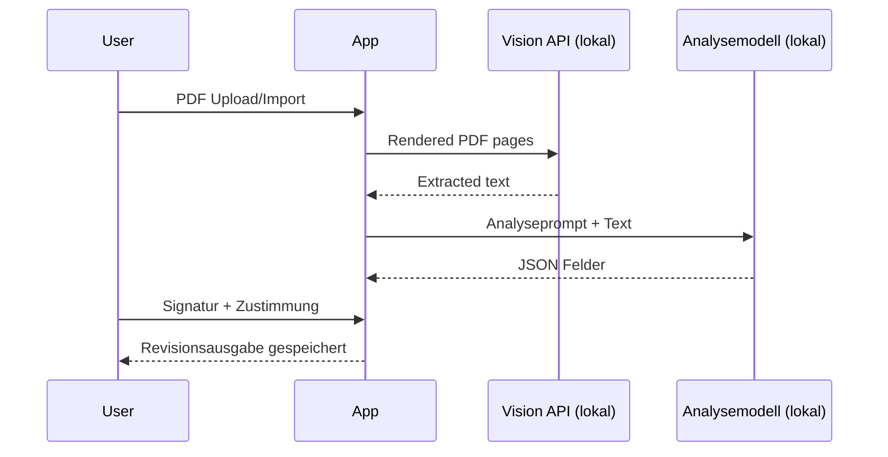
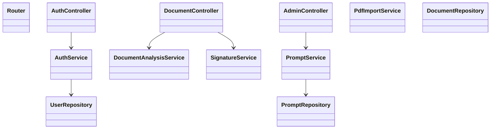

# Architekturdiagramm

```mermaid
flowchart LR
  Browser --> Router
  Router --> Controller
  Controller --> Service
  Service --> Repository
  Repository --> MySQL
  Service --> LocalVisionAPI
  Service --> LocalAnalysisAPI
```

# Sequenzdiagramm Gesamtworkflow

```mermaid
sequenceDiagram
  participant U as User
  participant A as App
  participant V as Vision API (lokal)
  participant M as Analysemodell (lokal)
  U->>A: PDF Upload/Import
  A->>V: Rendered PDF pages
  V-->>A: Extracted text
  A->>M: Analyseprompt + Text
  M-->>A: JSON Felder
  U->>A: Signatur + Zustimmung
  A-->>U: Revisionsausgabe gespeichert
```

# Klassendiagramm

```mermaid
classDiagram
  class Router
  class AuthController
  class DocumentController
  class AdminController
  class DocumentAnalysisService
  class PdfImportService
  class PromptService
  class UserRepository
  class PromptRepository
  class DocumentRepository
  AuthController --> AuthService
  DocumentController --> DocumentAnalysisService
  DocumentController --> SignatureService
  AdminController --> PromptService
  AuthService --> UserRepository
  PromptService --> PromptRepository
```
