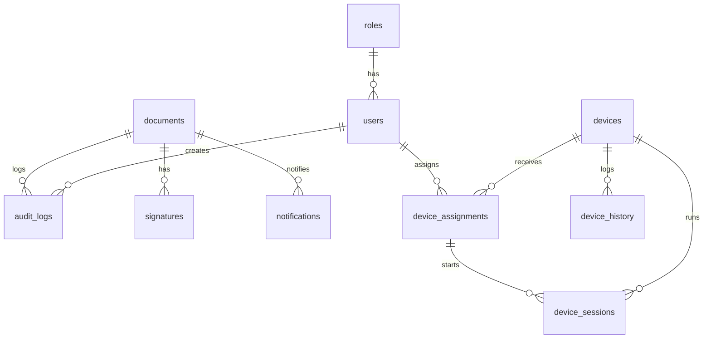

# Datenbankschema

Siehe `database/migrations/001_initial.sql`, `003_devices.sql` (Geräteverwaltung: `devices`, `device_assignments`, `device_sessions`, `device_history` – mit UUIDs, Foreign Keys und Indizes) sowie `004_notifications.sql` (Benachrichtigungen über abgeschlossene Hintergrund-Analysen).

## ER-Diagramm (Mermaid)

