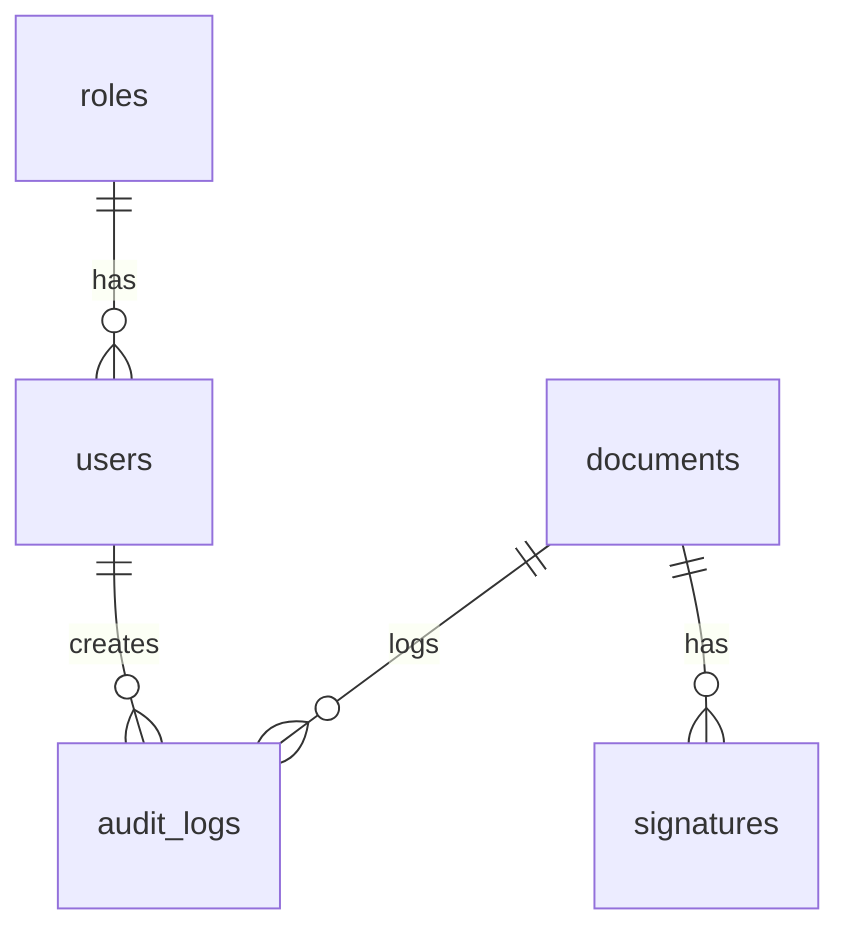

# Datenbankschema

Siehe `database/migrations/001_initial.sql`.

## ER-Diagramm (Mermaid)

```mermaid
erDiagram
  roles ||--o{ users : has
  users ||--o{ audit_logs : creates
  documents ||--o{ signatures : has
  documents ||--o{ audit_logs : logs
```
