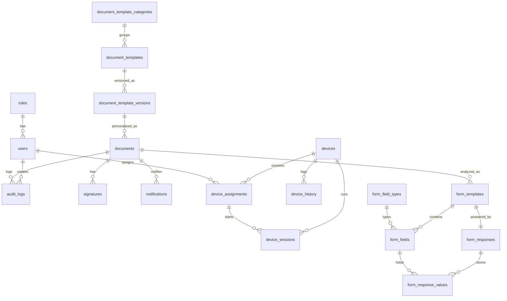

# Datenbankschema

Siehe `database/migrations/001_initial.sql`, `003_devices.sql` (Geräteverwaltung: `devices`, `device_assignments`, `device_sessions`, `device_history` – mit UUIDs, Foreign Keys und Indizes), `004_notifications.sql` (Benachrichtigungen über abgeschlossene Hintergrund-Analysen), `006_forms.sql` (interaktive Formulare), `007_health_history.sql` (`health_check_history` – Healthcheck-Snapshots je Komponente für den 48h-Zeitstrahl unter `/health`, automatische Bereinigung nach 14 Tagen) sowie `008_document_catalog.sql` (Dokumentenkatalog).

## Interaktive Formulare (`006_forms.sql`)

- `form_field_types` – erweiterbarer Katalog der Feldtypen (Freitext, Datum, Checkbox, Unterschrift …), Seed über `database/seeders/003_forms.sql`.
- `form_templates` – versionierte Formularvorlagen je Dokument (`UNIQUE(document_id, version)`, Quelle `acroform`/`vision`/`combined`/`manual`, Status `analyzing`/`ready`/`error`).
- `form_fields` – erkannte Eingabefelder mit relativen Koordinaten (0–1, Ursprung oben links), Optionen (`options_json`), Validierungsregeln (`validation_json`), Vorbelegungsschlüssel und Sortierung.
- `form_responses` – genau ein Antwortdatensatz je Vorlage (`UNIQUE(template_id)`), zugeordnet zu Dokumentversion und Patientenmappe (`case_number`); Status `in_progress`/`completed`/`signed`; nach Abschluss `filled_document_id` + `filled_pdf_path`.
- `form_response_values` – Eingaben je Feld (`UNIQUE(response_id, field_id)`), inkl. Gültigkeitsmerker.
- `documents` erhält zusätzlich `is_interactive` und `form_status` (`none`/`detected`/`analyzed`/`partial`/`complete`/`signed`/`error`).

## Dokumentenkatalog (`008_document_catalog.sql`)

- `document_template_categories` – Kategorien für die Katalogsuche (Seed über `database/seeders/005_document_catalog.sql`: Aufnahme, Datenschutz, Einwilligung, Behandlung, Forschung, Sonstiges).
- `document_templates` – PDF-Vorlagen mit Metadaten (Bezeichnung, Beschreibung, Dokumenttyp, Kategorie), Zustand (`is_active`, `is_archived`), Ersteller/Bearbeiter und Zeiger auf die aktuelle Version (`current_version`).
- `document_template_versions` – unveränderliche Versionsstände je Vorlage (`UNIQUE(template_id, version)`) mit Dateipfad, Originaldateiname, Dateigröße und beim Hochladen erkannten Platzhaltern (`placeholders_json`). Beim Ersetzen einer Vorlage entsteht eine neue Version; bestehende Versionen werden nie überschrieben.
- `documents` erhält zusätzlich `template_version_id` (FK auf die verwendete Vorlagenversion, `NULL` für importierte/hochgeladene Dokumente) und `sort_order` (Anzeige-Reihenfolge innerhalb einer Patientenmappe; alle Mappen-Abfragen sortieren nach `sort_order, created_at`).
- Der Seeder legt außerdem die Rolle `dokumentenmanagement` an (Zugriff ausschließlich auf `/admin/document-catalog`).

## ER-Diagramm (Mermaid)

