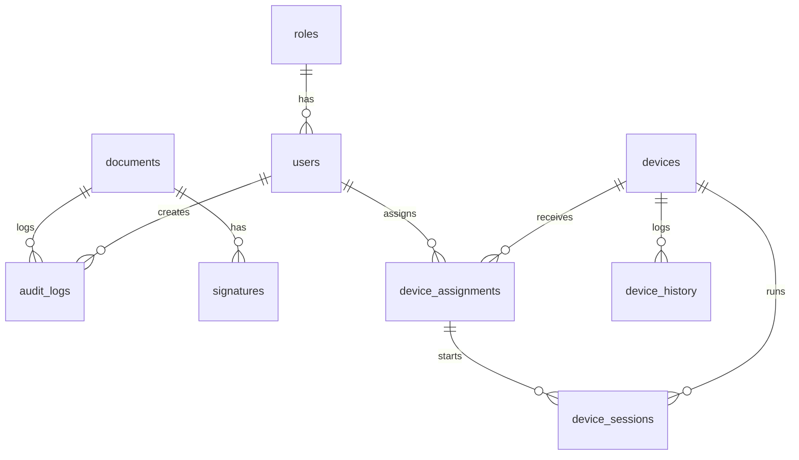

# Datenbankschema

Siehe `database/migrations/001_initial.sql` sowie `003_devices.sql` (Geräteverwaltung: `devices`, `device_assignments`, `device_sessions`, `device_history` – mit UUIDs, Foreign Keys und Indizes).

## ER-Diagramm (Mermaid)

